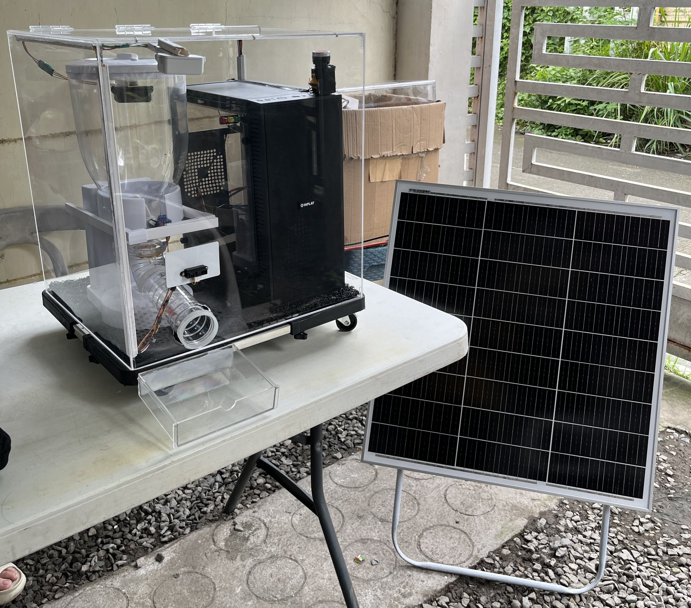

# Kibbler Firmware Code

This project contains the firmware code for the Kibbler smart pet feeder, based on ESP32. It integrates with Blynk and Firebase for remote monitoring, feeding control, and data logging.

## Features
- Wi-Fi connectivity (credentials stored in `secrets.h`)
- Blynk IoT integration for remote control and status
- Firebase Realtime Database for data storage and device management
- RFID-based pet identification
- Servo-controlled food dispensing
- Battery and solar power monitoring
- Deep sleep and wake-up scheduling
- Tray and container level monitoring (ultrasonic sensors)
- Stale food detection and alerts
- Pet name management and feeding history

## File Structure
- `kibbler.ino` — Main firmware source code
- `secrets.h` — **Sensitive credentials and paths** (Wi-Fi, Blynk, Firebase). **not shared publicly**

## Setup Instructions
1. **Install Arduino IDE** and ESP32 board support.
2. **Clone this repository** to your local machine.
3. **Add the following libraries** via Library Manager or manually:
   - Blynk
   - Firebase ESP Client
   - ESP32Servo
   - SPI
   - Any custom libraries (e.g., `R200.h` for RFID)
4. **Configure `secrets.h`:**
   - Update Wi-Fi, Blynk, and Firebase credentials as needed.
5. **Connect hardware:**
   - ESP32 board
   - Servo motor (food dispenser)
   - Ultrasonic sensors (tray/container)
   - RFID reader
   - LEDs, button, battery/solar setup
6. **Compile and upload** `kibbler.ino` to your ESP32.

## Security Notice
- All sensitive credentials are stored in `secrets.h`.

## Usage
- Device will connect to Wi-Fi, Blynk, and Firebase on boot.
- Use the Blynk app to monitor and control the feeder.
- Feeding events, battery status, and other data are logged to Firebase.
- RFID tags are used to identify pets and control feeding intervals.

## License
This project is for personal and educational use. Commercial use is not permitted without permission.

---

For questions or support, please contact the project maintainer.
